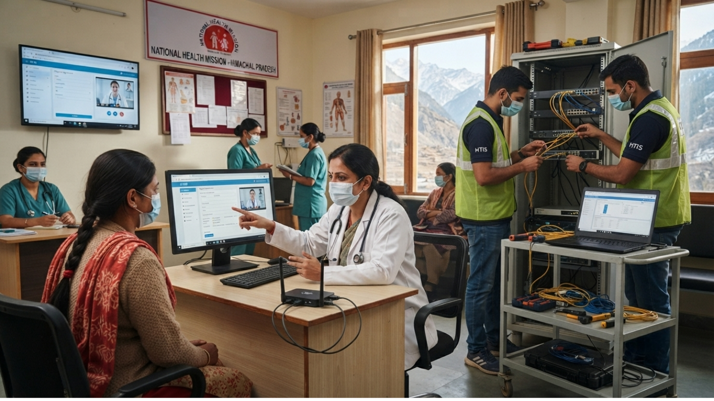
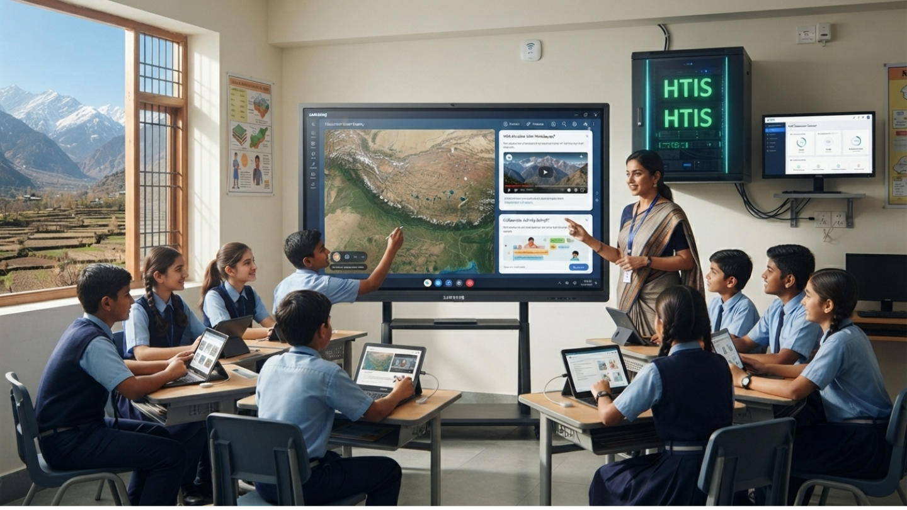

## Executive Industry overview

The airport authority needed a unified security backbone that could cover public terminals, restricted staff areas, service corridors, and airfield perimeters without slowing passenger movement. HTIS proposed a phased modernization program that combined **AI-enabled surveillance**, biometric access control, and a centralized command workflow.

This sample narrative is intentionally written as loose Markdown. Editors can use paragraphs, **bold emphasis**, lists, blockquotes, and [external reference links](https://example.com) without changing the structured case-study sections below.

## Discovery and planning

During the initial audit, the project team mapped camera blind spots, access-control delays, cable routing constraints, and control-room escalation paths. The biggest issue was not a single device failure, but the lack of a connected operational picture across terminals.

- Reviewed high-risk passenger and staff movement zones
- Tagged legacy analog cameras for phased replacement
- Prioritized gates, baggage corridors, and perimeter roads
- Defined handover checkpoints for airport security teams

## Implementation approach

HTIS staged the rollout around live airport operations so that security coverage remained active throughout the transition. New IP cameras were commissioned in clusters, while biometric checkpoints were introduced first in staff-only routes before expanding into broader controlled zones.

> The goal was not only to add more devices, but to make alerts, identity events, and live video easier for operators to act on.

The final command-room workflow connected access events with matching camera feeds, helping operators move from passive monitoring to faster incident verification.

## Sample impact narrative

After deployment, the airport team gained a single operational view across passenger halls, staff gates, service corridors, and perimeter areas. This reduced manual cross-checking between systems and helped the security team respond faster during peak movement windows.

For a production case study, this section could include a richer story around stakeholder alignment, rollout phases, lessons learned, or a link to a downloadable [modernization brief](https://example.com).
